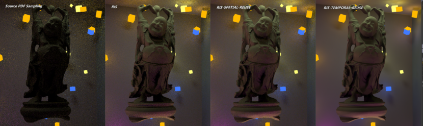

# ReSTIR through Vulkan

## 一、项目概述
本项目采用vulkan对ReSTIR进行初步复现，目前已完成Lambert材质有偏版本的实时降噪。

在基于蒙特卡洛方法的路径追踪中，多光源场景由于光照分布复杂，即使在离线渲染条件下，也难以获得低噪声的图像输出。而实时路径追踪进一步受限于性能预算与帧率要求，使得在此类场景下实现高质量、低噪声渲染更具挑战性。
ReSTIR（Spatiotemporal Reservoir Resampling）方法由 Benedikt Bitterli 等人提出，并发表于 SIGGRAPH 2020。其通过引入时空重采样机制，以轻量级的数据结构实现了对动态场景中直接光照的高质量采样，为实时光追提供了新范式，已被广泛应用于工业渲染框架中，并不断衍生出面向全局光照的变体（如 ReSTIR GI）。

我基于 Vulkan 构建了一套多pass渲染管线，涵盖图形管线（graphics pipeline）、计算管线（compute pipeline）与光线追踪管线（ray tracing pipeline），实现了对动态场景中降噪图像的实时可交互渲染。核心实现包括基于 **RIS（Resampled Importance Sampling）** 与 **WRS（Weighted Reservoir Sampling）** 的重要性采样模块，能够在每个光线与场景交点处，选择具有代表性的光照样本，有效抑制蒙特卡洛估计中的随机噪声。

从开发经验上看，Vulkan 相较 OpenGL 更贴近底层硬件抽象，其对资源调度、同步控制、内存管理等细节要求更高，显著提高了实现难度与学习门槛。为加快开发进度，我基于 NVIDIA 官方开源的 nvpro-samples 框架进行构建，该框架封装了部分 Vulkan 管理模块，有助于专注于渲染算法本身的实现逻辑。

如图是自制多光源场景下cornel-box的直接光照渲染结果，注意观察不容易被照亮的区域，如龙的口腔和底部，都被有效照亮，且每像素仅发射8条实际光线的情况下几乎没有噪点。


## 二、算法实践

Vulkan API中提供了三种基本管线：1、图形管线负责一次传统的光栅化图形渲染，包括顶点处理、几何着色器、图元装配、顶点着色器、光栅化、片元着色器、模板与混合等图形学流程；2、计算管线负责一次GPU通用计算任务的执行；3、光线追踪管线负责调用GPU硬件实现的加速结构遍历模块和求交模块来高效完成光线与场景的求交，并且会调用用户编写的几种着色器程序来处理交点的着色。
基于论文中的算法流程，本项目在算法实现上采用多Pass分离式渲染架构，通过vulkan显示管理管线之间的依赖与资源同步，重要流程如下图所示。每个pass是指一条管线的完整执行，之所以采用多pass分离的方式，是基于各阶段任务特点、资源需求和同步需求综合考虑的结果。具体流程如下：


1、场景数据加载后，会为其配置gpu buffer，并在gpu中构建光线求交的加速结构。随后在cpu端将所有发光三角形集中管理，并上传到gpu buffer中，单独进行光源管理是为了后续直接光照采样的方便。

2、game loop中每一帧的渲染包括5条管线，首先利用图形管线快速生成场景的G-buffer，即用图像记录当前帧的各pixel的世界坐标、纹理、法向量等信息。

3、通过第一条compute pipeline对光源进行采样，并基于生成的G-buffer评估候选样本点的权重，从而执行RIS和WRS算法，写入reservoir buffer，其中存储着每一个像素的reservoir结构（论文中的算法2）。此外，对于最终选取的光源样本还要进行可见性测试，如该光源不可见，则将该样本的权重调整为0。

4、第二条compute pipeline基于每个像素生成的reservoir结构，模块化地完成空间和时间的复用，为每个像素生成概率上最重要的光源样本。

5、Ray tracing pipeline读取最终生成的光源样本，根据材质调用不同的着色器进行渲染。
其实每一个pass都相当于算法的一层for循环，但在gpu中需要防止因并行显存读写所带来的冲突，保证内存一致性和可见性。因此需要用不同的pass隔离，并在pass间进行内存同步。

## 三、关键技术实现
算法的核心代码集中在项目文件path tracer/shaders/目录下的cs_ResampledIS.comp、cs_SpatialReuse.comp、raytrace.rchit和raytrace.rgen中，它们是用GLSL语言撰写的着色语言程序，由gpu驱动编译后直接运行在gpu中。
- 蓄水池结构
结构体Reservoir存储每一个像素的光照样本和计算权重所需的数据。每次生成样本都通过“updateReservoir”函数更新蓄水池内的样本和权重。

- RIS算法实现
在cs_ResampledIS.comp中实现了重要性重采样。
我将提议分布设定为对光源权重采样的分布，即“采样光源的亮度/所有光源的总亮度”。前文提到，在程序载入场景文件后，cpu会将所有发光三角形统一管理在一个buffer中。其实为了采样的高效，我还向gpu上传了一个辅助数据结构，即光源亮度的前缀和数组。通过该数组，在gpu端以“二分查找”快速选取光源样本，即能实现候选样本的分布正比于其亮度。
目标分布设定为getLuminance(Light Radiance* brdf)\*G，其中函数getLuminance按照人眼对rgb颜色分量的灵敏度将光照向量转换为亮度，G则代表几何项，这是提议分布所没有考虑的。此处并没有将光源可见性V项加入目标分布中，这是从效率的角度做出的权衡。虽然我们希望目标分布与brdf\*L\*G\*V成正比，但为每一个候选样本都发射阴影射线并判断光源的可见性的开销是巨大的。因此，算法中改为仅对最终样本进行光源可见性测试。最终，如果光源样本实际不可见，则将其所在的蓄水池的总权重设置为0。

- 空间重用实现。在cs_SpatialReuse中实现了空间样本的重用。
实验发现空间重用的效果与超参数的设置有很大的关系，似乎难以一组参数在每个测试场景中都取得稳定的效果。我最终设定在半径为6的圆中随机选取5个邻居，每帧循环3次，即每一个像素都会参考15个邻居的最终样本。
由于物体边缘发生几何骤变，此时空间重用会带来边缘的“模糊”效果，好在第一个pass已经得到了场景的G-buffer，可以读取深度图、法向量图等拒绝掉几何情况差异大的邻居。

- 在时间重用方面，论文通过计算帧的运动向量，从上一帧中对应位置获取上一帧的最终样本。我尚并未能实现这一部分，仅在没有发生场景变化和视角变换的静态情况下使用上一帧的样本。
由于目标分布与渲染点的brdf、几何都密切相关，这就导致空间重用的邻居像素的样本不应该直接用来更新当前像素的蓄水池，而需要进行权重更新。论文中的权重更新有两种方式，一种是快速但结果有偏的，另一种会增大计算开销但结果无偏。在实现中，我尝试的是前者，测试发现在物体边缘部分确实与ground truth有略微差别，这是正是因为邻居目标分布骤变导致。


## 四、运行
项目采用cmake进行工程文件的生成和编译。由于采用了vulkan api和光线追踪扩展，项目需要以下软硬件基础配置：

- vulkan 1.4及以上（下载地址https://www.vulkan.org/）。
- 支持VK_KHR_ray_tracing_pipeline （光线追踪扩展）的硬件显卡和驱动（查询地址：https://vulkan.gpuinfo.org/listextensions.php）。

项目的构建与运行指令如下。目前测试建议使用debug模式，因为我目前的项目实现还存在驱动层面一个资源同步的bug没有解决，release模式脱离vulkan的验证层的帮助可能闪退。

```c++
git clone --recursive --shallow-submodules https://github.com/nvpro-samples/nvpro_core.git
git clone this_project
cd path/to/project
mkdir build
cd build
cmake -DCMAKE_BUILD_TYPE=Debug ..
cmake --build .
cd ../../bin_x64/Debug
vk_path_tracer_KHR.exe
```
最后项目结构应该为：

```c++
PROJECT/ 
├── bin_x64/ # 编译后 64 位二进制可执行文件输出目录
├── downloaded_resources/ # 自动下载或外部依赖的资源（模型、贴图、HDR 等）
├── nvpro_core/ # NVIDIA-ProCore 工具包／库（封装了常用 Vulkan 辅助代码）
└── ReSTIR_path_tracer/ 
├── common
├── media
├── path_tracer/ # Path Tracer 核心代码
│ ├── shaders/ # GLSL/HLSL 着色器源文件（ReSTIR、Path Tracing 等各阶段）
│ └── spv/ # 编译后的 SPIR-V 着色器（二进制格式，用于加载到 Vulkan 中）
└── .cpp/.h/   # 其他源文件
```


## 五、结果

如下是多个小面积光源场景下的渲染结果对比，均设置每像素发8条随机光线（spp=8），进行直接光照的渲染。其他配置为：

RIS的提议分布将产生M=32个候选样本；空间重用每帧进行k=3次，每次随机选取周围半径R=5以内的至多5个几何情况接近的邻居。

图中左上方的Source PDF Sampling是指仅采用提议分布的结果，明显有大量噪点；中间是采用了RIS+WRS算法的结果，注意到整体变亮且噪声明显减少，这说明每个着色点都在RIS算法的指导下，采用了更重要的光线进行着色；右上方是加上空间重用后的结果，噪声进一步减少；下方分别是“RIS+时间重用”和“RIS+时空重用”在若干帧之后的结果，此时每个着色点都积累了多帧的渲染结果，因而几乎看不到噪声。


下图组是经典模型budda的测试结果，算法性能明显。但注意到空间重用虽然有效降低了噪声，但仔细观察发现有圆形结构化的伪影，可能是因为空间样本的选取不够随机所导致，之后可尝试采用低差异性序列改善这一问题。


在时间开销方面，ReSTIR算法在spp=8下的时间开销约等于Source PDF Sampling在spp=1024下的开销，且前者几乎没有噪声，后者噪声明显。

